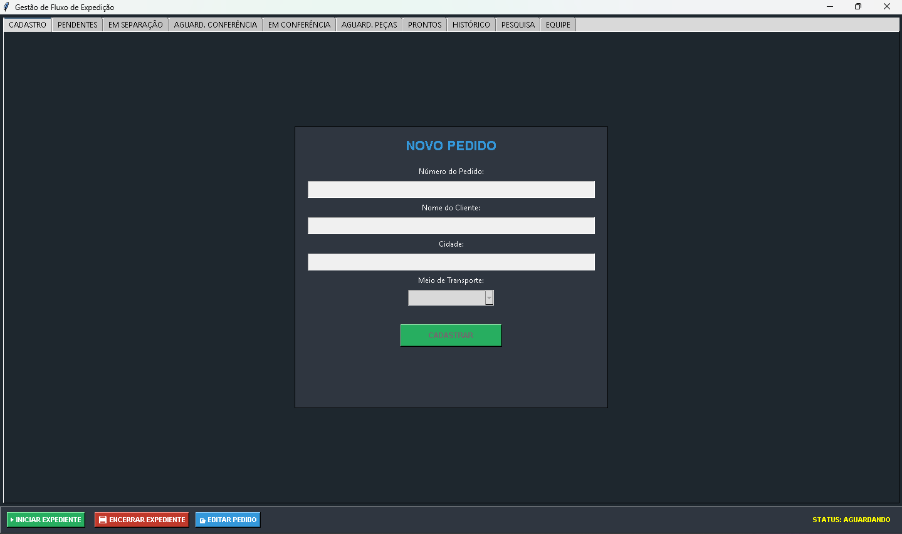

# 🚚 Sistema de Gestão de Expedição

<p align="center">
  Sistema desktop para gerenciamento completo do fluxo logístico de pedidos, desde o cadastro até a expedição final.
</p>

---

## 🚀 Sobre o Projeto

O **Sistema de Gestão de Expedição** foi desenvolvido para otimizar e organizar o processo logístico de separação, conferência e envio de pedidos.

O sistema permite acompanhar cada etapa do pedido, atribuir responsáveis, controlar o expediente e gerar etiquetas para envio, garantindo maior controle e rastreabilidade.

---

## 🔄 Fluxo do Sistema

O sistema gerencia todo o ciclo de vida de um pedido:

1. **Pendente**
   - Pedido recém cadastrado

2. **Em Separação**
   - Pedido atribuído a um separador responsável

3. **Aguardando Conferência**
   - Pedido separado e aguardando validação

4. **Em Conferência**
   - Conferente valida o pedido

5. **Pronto**
   - Pedido finalizado e liberado para expedição

6. **Aguardando Peças**
   - Pedido pausado por falta de itens

---

## 🧩 Funcionalidades

✔️ Cadastro e gerenciamento de pedidos  
✔️ Controle de status em múltiplas etapas  
✔️ Atribuição de responsáveis (separador e conferente)  
✔️ Controle completo do fluxo logístico  
✔️ Registro de volumes por pedido (ex: 1/10, 2/10...)  
✔️ Inclusão de Nota Fiscal (NF)  
✔️ Geração de etiquetas térmicas (100x100)  
✔️ Aba de pesquisa para rastreamento de pedidos  
✔️ Busca rápida de pedidos na aba "Prontos"  
✔️ Controle de expediente (início e encerramento)  
✔️ Bloqueio de operações fora do expediente  
✔️ Edição de pedidos  
✔️ Interface gráfica com Tkinter  
✔️ Banco de dados SQLite  

---

## 🔍 Consulta e Rastreamento

O sistema possui uma aba dedicada de pesquisa que permite:

- Buscar pedidos por diferentes critérios  
- Visualizar o status atual  
- Acompanhar o andamento dentro do fluxo logístico  

---

## 🔎 Busca Rápida

Na aba **Prontos**, o sistema disponibiliza:

- Campo de busca para localizar pedidos específicos  
- Acesso rápido para finalização e expedição  

---

## ⏱️ Controle de Expediente

O sistema possui controle de operação por expediente, garantindo maior organização e segurança:

- Botão para **Iniciar Expediente**
- Botão para **Encerrar Expediente**
- Bloqueio de ações enquanto o expediente não estiver ativo

Isso evita operações indevidas fora do período de trabalho.

---

## ✏️ Edição de Pedidos

O sistema permite editar pedidos já cadastrados, possibilitando correção de informações e maior flexibilidade na operação.

---

## 🖨️ Geração de Etiquetas

O sistema gera etiquetas térmicas no padrão **100x100**, contendo:

- Nº do Pedido  
- Cliente  
- Nota Fiscal (NF)  
- Cidade  
- Volume (ex: 1/10, 2/10...)  

Facilitando a organização e rastreamento na expedição.

---

## 🛠️ Tecnologias Utilizadas

- Python  
- SQLite  
- Tkinter  
- Pandas  
- ReportLab  

---

## 📷 Demonstração

> ⚠️ Adicione imagens reais do sistema para melhor visualização:

- Tela de cadastro de pedidos  
- Tela de separação  
- Tela de conferência  
- Tela de pedidos prontos  

Exemplo:

```


```

## ▶️ Como Executar o Projeto

### 🔧 Pré-requisitos

- Python 3.10 ou superior instalado  
- Pip (gerenciador de pacotes do Python)

---

### 📥 Instalação

1. Clone o repositório:

```bash
git clone https://github.com/seuusuario/sistema-expedicao.git
```

2. Acesse a pasta do projeto:

```bash
cd sistema-expedicao
```
3. Instalar dependências:

```bash
pip install -r requirements.txt
```

4. Executar o sistema:

```bash
python expedicao.py
```

## 👨‍💻 Autor

Richard Siqueira 

[](https://www.linkedin.com/in/richard-siqueira-74a297263/)
